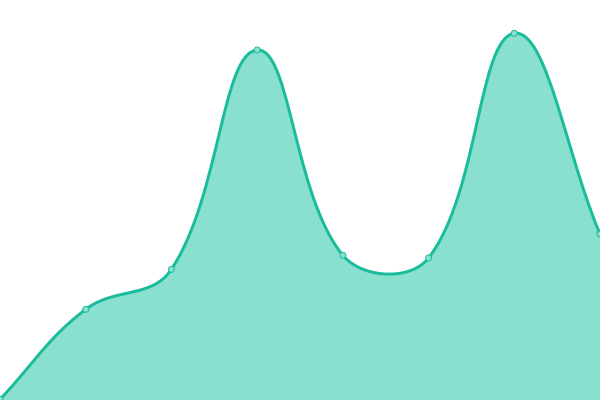
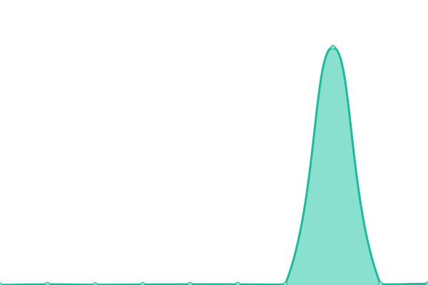
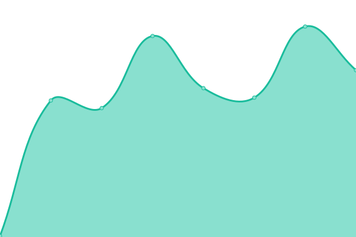

# [📈 Live Status](https://sahal.github.io/cbgn-uptime): <!--live status--> **🟩 All systems operational**

This repository contains the open-source uptime monitor and status page for [Sahal Ansari](http://sahal.info), powered by [Upptime](https://github.com/upptime/upptime).

With [Upptime](https://upptime.js.org), you can get your own unlimited and free uptime monitor and status page, powered entirely by a GitHub repository. We use [Issues](https://github.com/sahal/cbgn-uptime/issues) as incident reports, [Actions](https://github.com/sahal/cbgn-uptime/actions) as uptime monitors, and [Pages](https://sahal.github.io/cbgn-uptime) for the status page.

<!--start: status pages-->
<!-- This summary is generated by Upptime (https://github.com/upptime/upptime) -->
<!-- Do not edit this manually, your changes will be overwritten -->
<!-- prettier-ignore -->
| URL | Status | History | Response Time | Uptime |
| --- | ------ | ------- | ------------- | ------ |
|  [Naked Domain](https://bikegridnow.org) | 🟩 Up | [naked-domain.yml](https://github.com/sahal/cbgn-uptime/commits/HEAD/history/naked-domain.yml) | 

 456ms
     
 | 

<a href="https://sahal.github.io/cbgn-uptime/history/naked-domain">100.00%</a>
    

|  [Cloudflare DNS Monitoring (via Google) - Addilyn](https://dns.google/resolve?name=bikegridnow.org&type=NS) | 🟩 Up | [cloudflare-dns-monitoring-via-google-addilyn.yml](https://github.com/sahal/cbgn-uptime/commits/HEAD/history/cloudflare-dns-monitoring-via-google-addilyn.yml) | 

 119ms
     
 | 

<a href="https://sahal.github.io/cbgn-uptime/history/cloudflare-dns-monitoring-via-google-addilyn">100.00%</a>
    

|  [Cloudflare DNS Monitoring (via Google) - Ryan](https://dns.google/resolve?name=bikegridnow.org&type=NS) | 🟩 Up | [cloudflare-dns-monitoring-via-google-ryan.yml](https://github.com/sahal/cbgn-uptime/commits/HEAD/history/cloudflare-dns-monitoring-via-google-ryan.yml) | 

 13ms
     
 | 

<a href="https://sahal.github.io/cbgn-uptime/history/cloudflare-dns-monitoring-via-google-ryan">100.00%</a>
    

|  API Token Test | 🟩 Up | [api-token-test.yml](https://github.com/sahal/cbgn-uptime/commits/HEAD/history/api-token-test.yml) | 

 721ms
     
 | 

<a href="https://sahal.github.io/cbgn-uptime/history/api-token-test">100.00%</a>
    

|  API Active Test | 🟩 Up | [api-active-test.yml](https://github.com/sahal/cbgn-uptime/commits/HEAD/history/api-active-test.yml) | 

 187ms
     
 | 

<a href="https://sahal.github.io/cbgn-uptime/history/api-active-test">100.00%</a>
    

<!--end: status pages-->

[**Visit our status website →**](https://sahal.github.io/cbgn-uptime)

## 📄 License

- Powered by: [Upptime](https://github.com/upptime/upptime)
- Code: [MIT](./LICENSE) © [Anand Chowdhary](https://anandchowdhary.com), supported by [Pabio](https://pabio.com)
- Data in the `./history` directory: [Open Database License](https://opendatacommons.org/licenses/odbl/1-0/)
